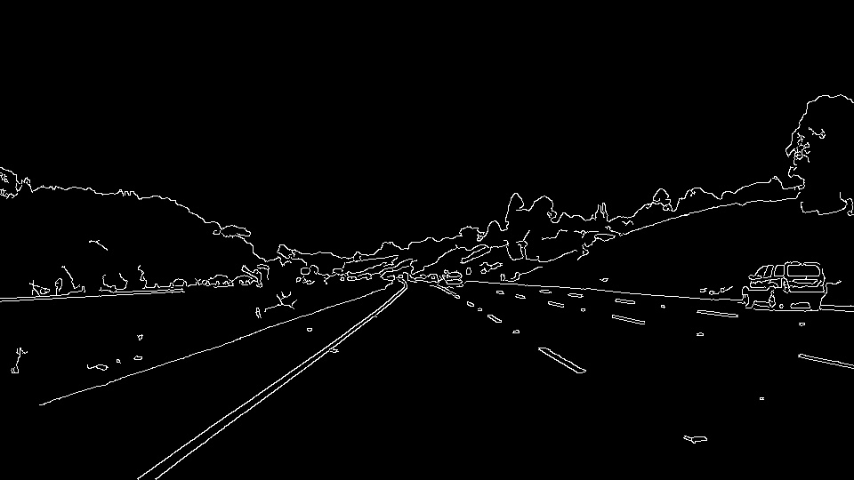
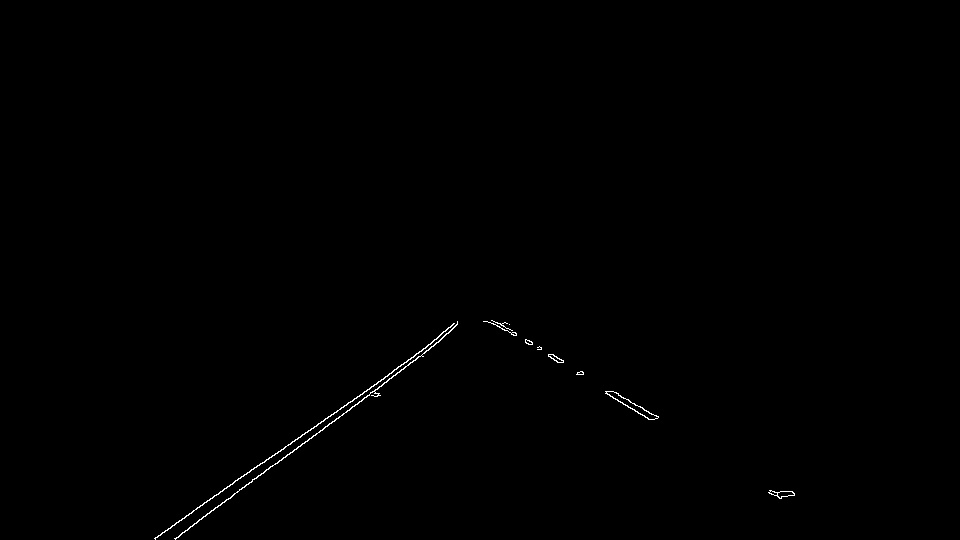

# **Finding Lane Lines on the Road** 

## Project 1: Finding Lane Lines in the Self-Driving Car Engineer Udacity Nanodegree

### A. Pipeline Description

The goal of this project was to make a pipeline that finds lane lines on the road. My pipeline consists of the following steps:

#### 1. Convert to Grayscale
First the image is converted to grayscale.

#### 2. Gaussian smoothing
A Gaussian blur is applied to suppress image noise by averaging.

#### 3. Canny transform to find edges
The Canny transform is used to reduce the image to edges by looking at the intensity gradient. The resulting image is made up of thin edges.

#### 4. Mask area of interest
The area of interest where we expect the lane to be found is masked. The far corners and top edge would be the furthest so we are less concerned with them.

#### 5. Hough transform
Next, the Hough transform is used to detect the lines in the image. The Hough transform is a way to represent Cartesian coordinate lines as points, i.e., (x,y) -> (m,b).

Once lines are detected, I modified the draw_lines() function to draw a single line on the left and right lanes. I did this by seperating the detected lines by positive and negative slope (calculated with numpy.polyfit()), and saving them into seperate arrays. I then used the polyfit function again to find the first order line corresponding to the endpoints of the positive and negative slope arrays. These were the final lines I drew onto the original image.

### B. Current Pipeline Shortcomings

The current pipeline is not perfect. A couple potential shortcomings:
* Perpendicular lane lines. The image masking I did has the assumption that the camera is generally centered and facing down the center of the lane. If we want to detect perpendicular lanes they will mostly be discarded.
* Missing or faint lane lines. If lane lines are obstructed by snow, rain, etc or worn to the extent that they are difficult to see the pipeline will not find correct lane lines.

### C. Future Improvements

So many possible improvement, so little time! Some future improvements that could be done:
* Filtering of spurious lines. Better filtering could be done to ensure spurious lines caused by lighting and markings (e.g., cracks) on the pavement are not used as lane lines. This one would help the occasional flickering seen in the videos.
* Instead of simple straight lines drawn, better curve fitting to enable curved lane lines to be drawn.
